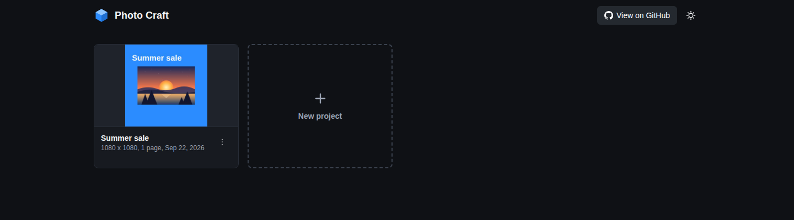
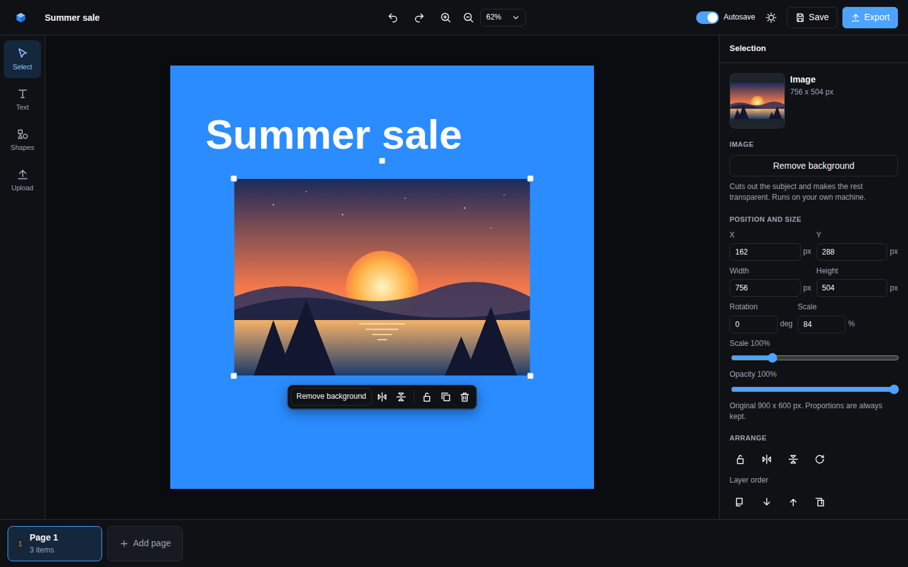

# Photo Craft

A simple, open source photo editor with everything you need for basic photo editing. Free transparent background exports, free background removal, and none of the fluff.

I built it because I was tired of using Canva and being limited on features that cost them nothing to run, like removing a background or exporting a PNG with a transparent background. Photo Craft does those for free, in your browser, with your projects saved on your own machine.

## Screenshots





## What you get

- Text, shapes and images on as many pages as you like, with undo and redo.
- More than 250 fonts, a colour picker with the colours your project already uses at the top, and a floating toolbar next to whatever you select.
- Resize from the corners, rotate, flip, lock, align and reorder. Alignment guides snap to the page and to other items.
- Export at any size as PNG, JPG, WebP or PDF, with a transparent background where the format allows it.
- One click background removal, powered by the open source rembg model running on your own machine.
- Preset sizes for social posts, thumbnails, logos, wallpapers and print, or any custom size.
- Light and dark mode. Projects live in your browser's storage, saved on demand or with autosave.

Use it at [photo-craft.vercel.app](https://photo-craft.vercel.app). The hosted version has everything except background removal, which needs Python on the server.

## Run it yourself

```bash
npm install
npm run dev
```

Then open http://localhost:3000.

```bash
npm run build      # production build
npm start          # serve the production build
npm test           # unit tests
npm run typecheck  # tsc
npm run lint       # eslint
```

## Background removal

Select an image and press "Remove background" in the toolbar, the side panel or the right click menu. It runs on the machine that serves the app with the open source [rembg](https://github.com/danielgatis/rembg) model, so nothing leaves your machine. It needs Python 3.9 or newer:

```bash
pip install -r requirements.txt
```

Then restart the server. The first removal downloads the model (about 170 MB) and can take a minute. After that each image takes a few seconds on a normal CPU.

| Variable | Meaning |
| --- | --- |
| `PHOTO_CRAFT_PYTHON` | Interpreter to use, for example the one inside a virtual environment. Defaults to `python3`, then `python`. |
| `PHOTO_CRAFT_BG_MODEL` | rembg model name. Defaults to `u2net`. `isnet-general-use` is sharper on photos, `u2netp` is small and fast. |

If Python or rembg is missing the button stays disabled and the panel says why.

## Shortcuts

| Keys | Action |
| --- | --- |
| Ctrl+Z, Ctrl+Shift+Z | Undo, redo |
| Ctrl+S | Save |
| Ctrl+A | Select all |
| Ctrl+C, Ctrl+V | Copy, paste (also pastes images from the clipboard) |
| Ctrl+D | Duplicate |
| Delete | Remove selection |
| Arrows, Shift+Arrows | Nudge by 1 px or 10 px |
| V, T | Pointer tool, text tool |
| Ctrl+Plus, Ctrl+Minus, Ctrl+0 | Zoom in, zoom out, fit |
| Escape | Deselect or finish editing text |
| Ctrl+Wheel | Zoom around the pointer |
| Wheel | Pan |

## How the code is organised

Next.js 15 with the App Router. Three routes: `/` (your projects), `/new` (pick a size) and `/editor/[projectId]`.

- `src/model`: the project, page and element types, plus factories.
- `src/data`: presets, fonts, colours and shape geometry.
- `src/lib`: browser free helpers: geometry, snapping, IndexedDB, ZIP writing, image loading, popover and toolbar placement, colour extraction, and the export renderer under `src/lib/export`.
- `src/store`: the zustand stores. `project-store` holds the open project, selection, live previews and undo history and is split into slices. `editor-ui-store` holds tool, panel, zoom, pan and the open menus.
- `src/hooks`: React hooks for saving, autosave, shortcuts, theme, settings, live updates and background removal.
- `src/components`: UI. `editor/canvas` is the Konva stage with the quick toolbar and the context menu, `editor/panels` the side panel.
- `src/server` and `app/api/background-removal`: the server side of background removal. It keeps one Python worker (`scripts/background_remover.py`) alive and talks to it over stdin and stdout.

Every file stays small and does one thing. The export renderer and the live canvas share the same attribute builders in `src/lib/konva/element-attrs.ts`, so what you see is what you export.

## Licence

MIT.
