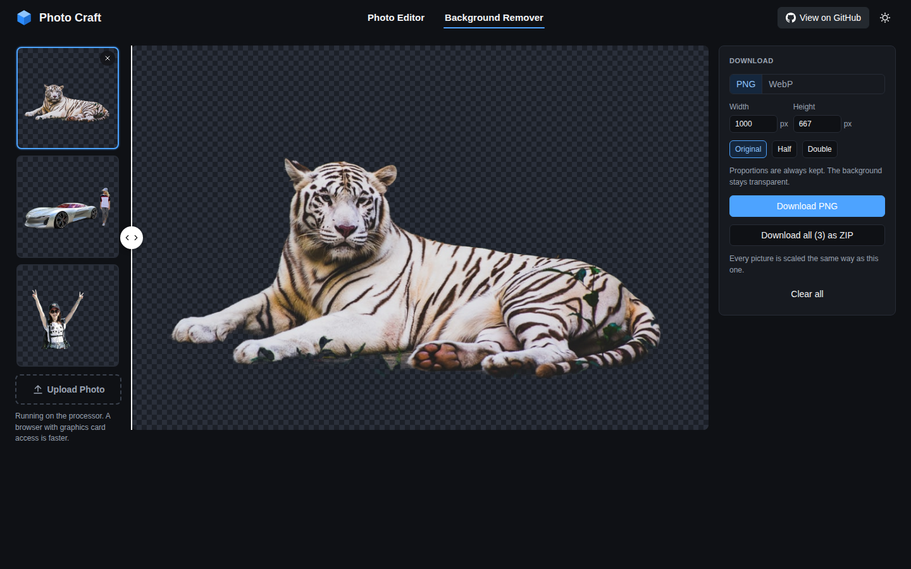

# Photo Craft

A simple, open source photo editor with everything you need for basic photo editing. Free transparent background exports, free background removal, and none of the fluff.

I built it because I was tired of using Canva and being limited on features that cost them nothing to run, like removing a background or exporting a PNG with a transparent background. Photo Craft does both for free, in your browser, with your projects saved on your own machine.

## Screenshots




## What you get

- Text, images and thirty shapes on as many pages as you like, with undo and redo.
- A draw tool for shapes of your own: click corners or drag freehand, straight or curved sides, open or closed.
- More than 250 fonts, a colour picker with the colours your project already uses at the top, and a floating toolbar next to whatever you select.
- Resize from the corners, rotate, flip, lock, align and reorder. Alignment guides snap to the page and to other items.
- Export at any size as PNG, JPG, WebP or PDF, with a transparent background where the format allows it.
- One click background removal, in the editor or on its own page where you can drop in a batch of pictures, flick through the cutouts and download any size. It runs in your browser, so nothing is uploaded.
- Preset sizes for social posts, thumbnails, logos, wallpapers and print, or any custom size.
- Light and dark mode. Projects live in your browser's storage, saved on demand or with autosave.

Use it at [photo-craft.vercel.app](https://photo-craft.vercel.app).

## Run it yourself

```bash
npm install
npm run dev
```

Then open http://localhost:3000.

```bash
npm run build      # production build
npm start          # serve the production build
npm test           # unit tests
npm run typecheck  # tsc
npm run lint       # eslint
```

## Background removal

Two places offer it. In the editor, select an image and press "Remove background" in the toolbar, the side panel or the right click menu. The cutout replaces the image as one undo step. On the Remove background page, drop, paste or pick as many pictures as you like. They are cut out one after another, the strip on the left switches between them (or use the left and right arrow keys), and the panel on the right downloads the one you are looking at as PNG or WebP at any size, or all of them at once as a ZIP.

It runs entirely in the browser with the ISNet model (isnet-general-use from the open source [rembg](https://github.com/danielgatis/rembg) project), the best of the cutout models that fit in a browser. With graphics card access it runs on WebGPU and takes a second or two per picture. Without it, it runs on WebAssembly and takes several seconds. The first use downloads the model (179 MB) and keeps it in the browser's cache, so later uses start straight away. There is no server side to it, so the hosted version has it too, and nothing you add is kept once you leave the page.

## Shortcuts

| Keys | Action |
| --- | --- |
| Ctrl+Z, Ctrl+Shift+Z | Undo, redo |
| Ctrl+S | Save |
| Ctrl+A | Select all |
| Ctrl+C, Ctrl+V | Copy, paste (also pastes images from the clipboard) |
| Ctrl+D | Duplicate |
| Delete | Remove selection |
| Arrows, Shift+Arrows | Nudge by 1 px or 10 px |
| V, T, P | Pointer tool, text tool, draw tool |
| Enter, Backspace, Escape | While drawing: finish the shape, take a corner back, start over |
| Ctrl+Plus, Ctrl+Minus, Ctrl+0 | Zoom in, zoom out, fit |
| Escape | Deselect or finish editing text |
| Ctrl+Wheel | Zoom around the pointer |
| Wheel | Pan |

## How the code is organised

Next.js 15 with the App Router. Four routes: `/` (your projects), `/remove-bg` (batch background removal), `/new` (pick a size) and `/editor/[projectId]`.

- `src/model`: the project, page and element types, plus factories.
- `src/data`: presets, fonts, colours and shape geometry, including the point lists and paths behind every shape.
- `src/lib`: browser free helpers: geometry, snapping, IndexedDB, ZIP writing, image loading, popover and toolbar placement, colour extraction, stroke simplification for the draw tool, and the export renderer under `src/lib/export`. `src/lib/background` holds the cutout model's maths and the worker that runs it, `src/lib/remove-bg` the sizing and download helpers of the background remover.
- `src/store`: the zustand stores. `project-store` holds the open project, selection, live previews and undo history and is split into slices. `editor-ui-store` holds tool, panel, zoom, pan and the open menus.
- `src/services/background-removal.ts`: the main thread side of the remover. It starts the worker and hands it pictures one at a time.
- `src/hooks`: React hooks for saving, autosave, shortcuts, theme, settings, live updates and the removal queue.
- `src/components`: UI. `editor/canvas` is the Konva stage with the quick toolbar and the context menu, `editor/panels` the side panel, `remove-bg` the batch cutout page and `site` the bar with the two sections.

Every file stays small and does one thing. The export renderer and the live canvas share the same attribute builders in `src/lib/konva/element-attrs.ts`, so what you see is what you export.

## Licence

MIT.
